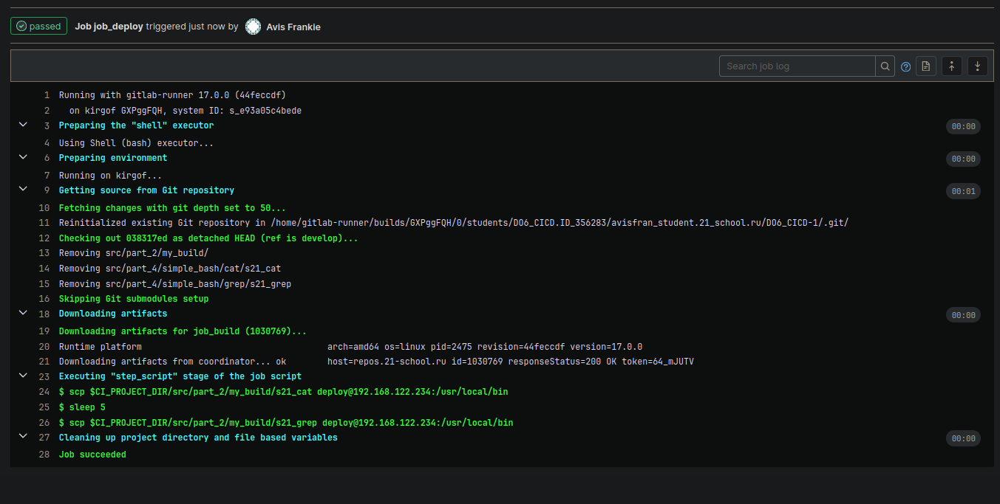

### Part 1. Настройка **gitlab-runner**

`-` Раз ты решил заняться CI/CD, должно быть, ты очень-очень любишь тестировать. Я тоже это люблю. Так что приступим. Если тебе потребуется какая-либо информация, рекомендую искать ответы в официальной документации.

**== Задание ==**

##### Подними виртуальную машину *Ubuntu Server 22.04 LTS*.
*Будь готов, что в конце проекта нужно будет сохранить дамп образа виртуальной машины.*

##### Скачай и установи на виртуальную машину **gitlab-runner**.

Для удобства на виртуалку захожу через ssh, для того чтобы был доступ к буферу хостовой машини без танцев с бубном.

##### Запусти **gitlab-runner** и зарегистрируй его для использования в текущем проекте (*DO6_CICD*).
- Для регистрации понадобятся URL и токен, которые можно получить на страничке задания на платформе.

### Part 2. Сборка

`-` Предыдущее испытание было создано, чтобы повышать в людях уверенность в себе.
Теперь я подкорректировала тесты, сделав их более сложными и менее льстивыми.

**== Задание ==**

#### Напиши этап для **CI** по сборке приложений из проекта *C2_SimpleBashUtils*.

##### В файле _gitlab-ci.yml_ добавь этап запуска сборки через мейк файл из проекта _C2_.

##### Файлы, полученные после сборки (артефакты), сохрани в произвольную директорию со сроком хранения 30 дней.

Чтобы написать yml, сначала нужно понять синтаксис gitlab ci. Вся эта история декларативная как в том же docker compose'e или nginx'e, поэтому нужно просто правильно выбрать keyword'ы и оформить. [В доке полнятно расписан синтаксис](https://docs.gitlab.com/ee/ci/yaml/).

Мы используем:

* stages 	The names and order of the pipeline stages. (Если проводить аналогию с Си, тут этап объявлен)
* script 	Shell script that is executed by a runner. 
* stage 	Defines a job stage.  (А здесь этап описан)
* artifacts 	List of files and directories to attach to a job on success. 
* artifacts:paths  [Тут много инфы, проще почитать доку](https://docs.gitlab.com/ee/ci/yaml/#artifactspaths).
* artifacts:expire_in  Use expire_in to specify how long job artifacts are stored before they expire and are deleted.

При регистрации config.toml закидывает в etc, поэтому при запуске раннера нужно использовать sudo, тогда он его тянит оттуда. Так же раннера нужно закинуть в группу sudo для выполнения некоторых скриптов.

Артифакты закинуло в репу gitlab'a.
Скачать можно в отработанной job'e.

### Part 3. Тест кодстайла

`-` Поздравляю, ты выполнил абсолютно бессмысленную задачу. Шучу. Она была нужна для перехода ко всем последующим.

**== Задание ==**

#### Напиши этап для **CI**, который запускает скрипт кодстайла (*clang-format*).

##### Если кодстайл не прошел, то «зафейли» пайплайн.

##### В пайплайне отобрази вывод утилиты *clang-format*.

Скрипт написать можно по разному, можно создать файл и там всё написать и запушить, а можно я ямл файле просто написать.
Специально испортили стиль, чтобы джоба отдала ошибку. Они реагирует на код завершения программы, 0 или 1. После этого пошли поправили код в сорцах, запушили, автоматом отработал раннер, т.к поступил новый коммит и как видно все ок.

### Part 4. Интеграционные тесты

`-` Отлично, тест на кодстайл написан. [ТИШЕ] Говорю с тобой тет-а-тет. Не говори ничего коллегам. Между нами: ты справляешься очень хорошо. [ГРОМЧЕ] Переходим к написанию интеграционных тестов.

**== Задание ==**

#### Напиши этап для **CI**, который запускает твои интеграционные тесты из того же проекта.

##### Запусти этот этап автоматически только при условии, если сборка и тест кодстайла прошли успешно.

##### Если тесты не прошли, то «зафейли» пайплайн.

##### В пайплайне отобрази вывод, что интеграционные тесты успешно прошли / провалились.

Из интересного:
* Нужно поправить старые тесты из проекта C2_SimpleBashUtils, чтобы они отдавали 0 и 1 при успешном/не успешном завершении программы. Т.к diff при сравнении даже если файлы разные, отдаешь код завершения программы 0.
* После джобы билд, артефакты сохранились в месте которые указывалось в paths, чтобы не пересобирать бинарники, а на боевых проектах это может занимать овер_много времени. Мы просто их копируем из paths в директорию где лежат тест скрипты и тест кейсы. 

### Part 5. Этап деплоя

`-` Для завершения этого задания ты должен перенести исполняемые файлы на другую виртуальную машину, которая будет играть роль продакшна. Удачи.

**== Задание ==**

##### Подними вторую виртуальную машину *Ubuntu Server 22.04 LTS*.

#### Напиши этап для **CD**, который «разворачивает» проект на другой виртуальной машине.

##### Запусти этот этап вручную при условии, что все предыдущие этапы прошли успешно.

##### Напиши bash-скрипт, который при помощи **ssh** и **scp** копирует файлы, полученные после сборки (артефакты), в директорию */usr/local/bin* второй виртуальной машины.
*Тут тебе могут помочь знания, полученные в проекте DO2_LinuxNetwork.*

- Будь готов объяснить по скрипту, как происходит перенос.

##### В файле _gitlab-ci.yml_ добавь этап запуска написанного скрипта.

сначала генерируем ssh ключ, далее его через ssh-copy-id прокидываем с ВМ на которой тестили и собирали, на целевую ВМ для деплоя. Далее через scp копируем бинарники в нужную директорию.
Т.к все ВМ в одной подсети, никаких танцев с бубмно не нужно, они пингуются свободно.
p.s нужно не забыть ключ генерить от юзера раннер, т.к именно он будт копировать. На машине деплоя, чтобы в bin закинуть что-то нужно либо sudo, либо быть владельцем, тут по желанию.

##### В случае ошибки «зафейли» пайплайн.

В результате ты должен получить готовые к работе приложения из проекта *C2_SimpleBashUtils* (s21_cat и s21_grep) на второй виртуальной машине.

##### Сохрани дампы образов виртуальных машин.
**P.S. Ни в коем случае не сохраняй дампы в гит!**
- Не забудь запустить пайплайн с последним коммитом в репозитории.

### Part 6. Дополнительно. Уведомления

`-` Здесь написано, что твое следующее задание выполняется специально для нобелевских лауреатов. Здесь не сказано, за что они получили премию, но точно не за умение работать с **gitlab-runner**.

**== Задание ==**

##### Настрой уведомления о успешном/неуспешном выполнении пайплайна через бота с именем «[твой nickname] DO6 CI/CD» в *Telegram*.

- Текст уведомления должен содержать информацию об успешности прохождения как этапа **CI**, так и этапа **CD**.
- В остальном текст уведомления может быть произвольным.
